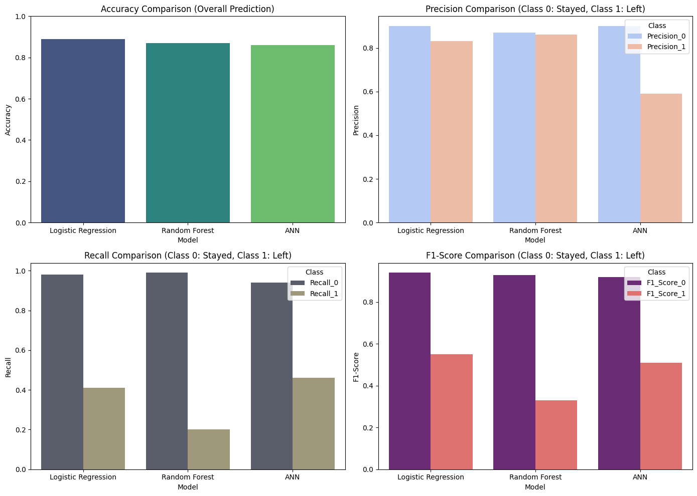

# Employee Attrition Prediction

### "An average company loses between 1% and 2.5% of their total revenue on the time it takes to bring a new hire up to speed."

- The cost of hiring a new employee averages $7,645 for small to mid-sized businesses.
- It takes 52 days on average to fill an open position.

Given these significant costs, understanding which employees are likely to leave becomes vital. By leveraging predictive analytics, companies can take proactive steps to minimise attrition, retain key talent, and reduce costs associated with turnover.

In this project, we use **Artificial Neural Networks (ANNs)**, along with other models like **Logistic Regression** and **Random Forest Classifier**, to predict employee attrition. The goal is to assist HR teams in identifying at-risk employees before they leave. With this knowledge, companies can implement retention strategies, ultimately saving time, money, and talent.

---

## Project Overview:
This project focuses on predicting employee attrition using a variety of factors such as job satisfaction, workload, and performance evaluations. The aim is to provide businesses with actionable insights to help reduce turnover and improve employee retention strategies.

### Why Predicting Attrition Matters:
- **Cost-saving**: Reducing the high costs associated with recruiting and training new employees.
- **Efficiency**: Preventing productivity gaps caused by prolonged hiring processes.
- **Employee morale**: Maintaining a stable and motivated workforce by retaining key talent.

## Key Features:
- **Model Comparison**: Evaluated three models (Logistic Regression, Random Forest, and ANN) to determine the most effective in predicting employee attrition.
  - Logistic Regression showed the highest accuracy and precision for predicting retention.
  - The ANN model demonstrated potential for identifying at-risk employees but requires further refinement for better recall.
- **Artificial Neural Networks (ANNs)**: Built using **TensorFlow** and **Keras** to capture complex relationships in the dataset.
- **Model Evaluation**: Used metrics like **accuracy**, **precision**, **recall**, and **F1-score** to assess the performance of each model, particularly in identifying employees at risk of leaving.
- **Data Visualisation**: Visualised key trends and model performance metrics using **Seaborn** and **Matplotlib**.

## Tools and Libraries:
- **TensorFlow**: For building and training the artificial neural network.
- **Keras**: Integrated with TensorFlow to construct and optimise the ANN.
- **Pandas**: For data manipulation and preprocessing tasks.
- **NumPy**: For numerical operations and feature scaling.
- **Scikit-learn**: For model evaluation and data preparation, including splitting and scaling.
- **Seaborn** & **Matplotlib**: For generating visualisations of data insights and model performance.

## How to View the Project:
To dive deeper into the methodology, code, and model results, explore the **Employee_Attrition_Prediction.ipynb** file in Jupyter Notebook.

[Link to the Jupyter Notebook on GitHub](https://github.com/idrismo45/Employee-Attrition-Prediction/blob/main/Employee_Attrition_Prediction.ipynb)

---

### **Summary:**

This project addresses a critical business challenge: employee attrition. The financial and operational burden of replacing employees, which can amount to thousands of dollars and weeks of lost productivity, makes it essential for HR teams to proactively identify at-risk employees and implement retention strategies. The goal was to leverage predictive analytics to forecast employee attrition and enable HR to take early action.

We compared the performance of three models—Logistic Regression, Random Forest Classifier, and Artificial Neural Networks (ANNs)—in predicting employee attrition.

### **Model Comparison:**

- **Logistic Regression**: This model showed the highest accuracy (0.89) and effectively handled the class imbalance between employees who stayed (`Class 0`) and those who left (`Class 1`). It excelled at predicting employees likely to stay, but struggled with recall for those who left. While it had high precision (0.83) for predicting leavers, it missed many at-risk employees (recall of 0.41), indicating the need for further tuning in identifying potential leavers.

- **Random Forest Classifier**: This model had similar accuracy (0.87) but performed poorly in terms of recall for leavers (`Class 1`). It was better at predicting those who would stay, but with a recall of only 0.20 for employees who left, it missed a significant portion of at-risk employees. Its precision and F1-scores showed that it worked best for predicting employee retention but was less effective in detecting attrition.

- **Artificial Neural Network (ANN)**: The ANN model demonstrated flexibility and captured complex relationships, achieving an accuracy of 0.86. However, it did not significantly outperform the other models in overall prediction. While it performed better than the Random Forest in recall for `Class 1` (0.46), it had lower precision (0.59), meaning it incorrectly flagged some employees as likely to leave. The model could benefit from further refinement, especially in balancing precision and recall for identifying leavers.

### **Key Insights for Implementation:**

- **Identify High-Risk Employees**: Employees predicted as leavers (`Class 1`), or those with lower confidence in their retention status, should be prioritised for intervention. These employees are more likely to leave and need focused attention.

- **Actionable Steps**: Implement personalised support strategies for these high-risk employees. Offering incentives like additional benefits, professional development opportunities, or improving workplace conditions can boost their job satisfaction and improve retention rates.

### **Next Steps:**

- **Model Enhancement**: The ANN model could benefit from further refinement to improve its ability to predict at-risk employees. Addressing class imbalance through techniques like SMOTE or experimenting with alternative architectures may enhance its performance.

- **Integrate Insights**: Use the predictions from the models to inform HR strategies. Tailored interventions based on the model’s forecasts can help preempt employee attrition, optimise resources, and improve workforce stability.

- **Ongoing Evaluation**: Regularly assess the effectiveness of the implemented retention strategies. Gather feedback from employees and adjust the interventions to ensure they effectively reduce turnover and foster a more engaged workforce.

**Conclusion**

This project demonstrates how predictive analytics can assist in managing employee attrition. While all three models show potential, the ANN model requires further improvements to boost its accuracy for identifying at-risk employees. By focusing on those employees predicted to leave and applying proactive interventions, companies can reduce turnover, save costs, and build a more stable and engaged team.

