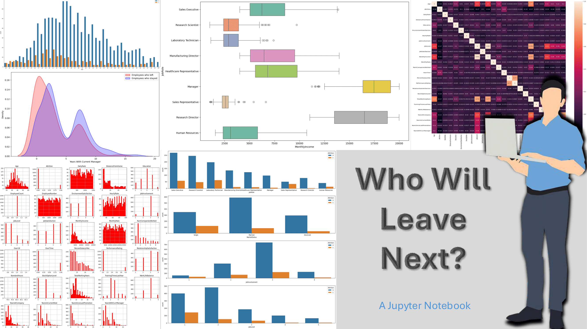

# Employee Attrition Prediction

This project uses Artificial Neural Networks (ANNs) to predict employee attrition based on various factors, including job satisfaction, workload, and performance. The goal is to help HR teams identify employees at risk of leaving and take proactive steps to improve retention.

## Key Features:
- Implemented an Artificial Neural Network using **TensorFlow** to predict employee attrition.
- Performed data preprocessing, feature scaling, and model evaluation.
- Used **Seaborn** and **Matplotlib** for visualising data trends and model performance.
  
## Tools and Libraries:
- **TensorFlow**: For building and training the neural network model.
- **Seaborn** & **Matplotlib**: For data visualisation and plotting model performance metrics.

## How to View the Project:
To explore the code and methodology used in this project, please open the **Employee_Attrition_Prediction.ipynb** file in Jupyter Notebook.

[Link to the Jupyter Notebook on GitHub](https://github.com/idrismo45/Employee-Attrition-Prediction/blob/main/HR_Employee_Retention.ipynb)

## Results:
The project accurately predicts the likelihood of employee attrition and provides insights into key factors contributing to attrition risk.
